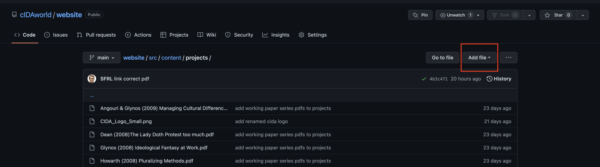
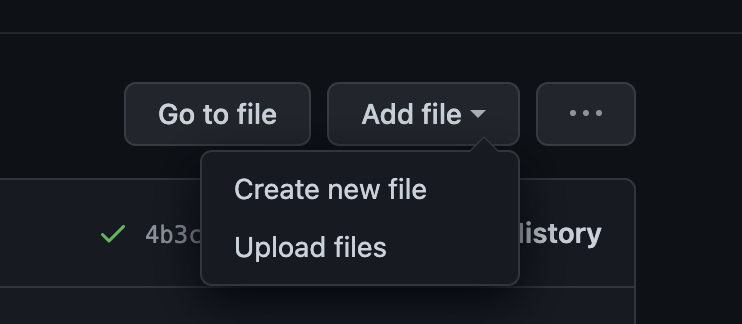
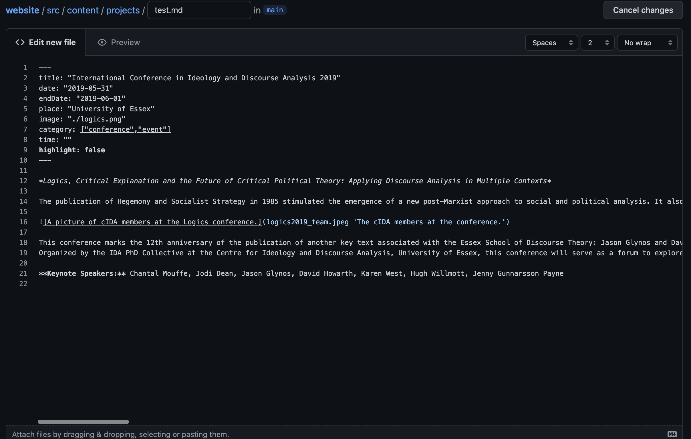
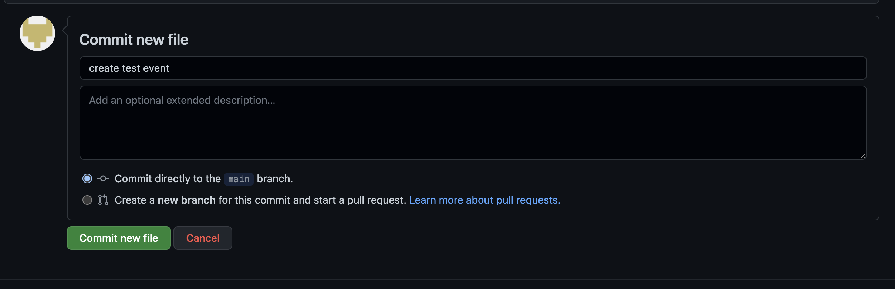
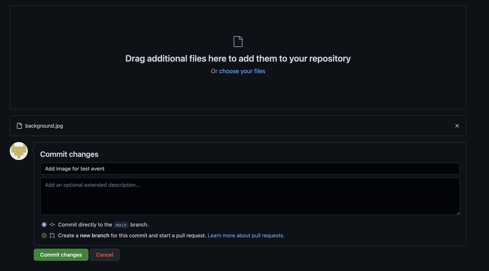
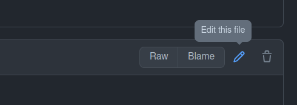
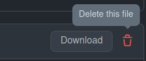

# Coeliac Disease and the Workplace - glutenowhere.com  


# Introduction

This guide provides you with all the information needed to update and maintain content for [glutenowhere.com](https://glutenowhere.com/). The only folder that you have to focus on is [src/content](./src/content). Inside that folder you will find 6 subfolders that contain content for the different website sections:

- **about:** the *About* section 
- **blog:** the *Blog* section 
- **engage:** the *Engage* section
- **landing:** the landing page, so the first page that visitors see when they go to glutenowhere.com 
- **reseach-corner:** the *Research Corner* section
- **socialmedia:** Social media handles that are used throughout the website


## Markdown 
For this website, you will write all of your content in markdown. [Markdown](https://en.wikipedia.org/wiki/Markdown) is a simple language for creating formatted text. Markdown files usually end with a `.md` extension. The most important things to remember about markdown syntax are: 

- *italic text* is achieved by placing an asterisk before and after the text you want to be italicised, e.g. `*italicised text*`
- **bold text** is achieved by pacing two asterisks before and after the text you want to be bold, e.g. `**bold text**`
- ***italic and bold text*** is achieved by placing three asterisks before and after the text that you want to be bold and italicised, e.g. `***bold and italicised text***`
- links are written in the form `[name of the link](URL that you want to link to)` for example `[Link to Google](https://www.google.co.uk/)` will result in [Link to Google](https://www.google.co.uk/)
- images are included in the form `` for example `` will result in <br><br>Cute Kitty<br>You should always include a short description of the image in alt text to make your website accessible for users who have a visual impairment. 

You can read more about basic Markdown syntax [here](https://www.markdownguide.org/basic-syntax/).

For this website, you can also embed youtube or vimeo videos in your content so visitors can watch the videos directly on the cIDA website. To embed a video follow these examples

`` `youtube: https://www.youtube.com/watch?v=NDWKTcvEOJM` ``<br>
for youtube you can just copy the URL of a video. If the URL contains the word *watch* you should have the right one.

`` `vimeo: 745375986?h=be905817e4` ``<br>
for vimeo you will have to include only the video id. You can find the id, by clicking on *share* on a vimeo video and choose the *embed* option. This will give you the html code you could use to embed the video. For example above it looks like this: 
```
<iframe title="vimeo-player" src="https://player.vimeo.com/video/745375986?h=be905817e4" width="640" height="360" frameborder="0" allowfullscreen></iframe>
```

The id is found in the `src` tag after `https://player.vimeo.com/video/`

## Markdown frontmatter
When looking at any markdown files in this project you will notice that they will start with something like this: 

```
---
title: "Coeliac Disease and the never-ending story of navigating social gatherings "
author: "Anne Steinhoff"
date: "2022-08-25"
image: "../../images/coeliac disease and the neverending story.jpg"
---
```

Everything between the `---` is called frontmatter. Frontmatter contains metadata for the content that you are creating, e.g. the title of an event and the date when it took place. This will make more sense when we talk about creating content for the individual sections. Frontmatter should be placed at the top of your markdown file. The main body of text should be added below the frontmatter.

**Note** it is important to strictly follow the format that is explained below for each tag in the frontmatter like the use of quotation marks `""`, brackets `[]` etc..

## Using images correctly
**Make sure that images are saved in the jpeg or png format**. Logos, especially round ones should be used in png format with transparent background. 

Make sure to choose an appropriate resolution for your image. If the resolution is too small, images will look low quality. If it is too high, the website will take a longer time too load. Here are some guidelines for images in different contexts:


## Uploading and creating files on GitHub
You can add content to any section by clicking `Add file` in the top left corner.



After clicking on `Add file` you can choose between `Create new file` and `Upload files`. 



If you want to add new written content (e.g. a blog post), you can create a new markdown file. Give your file a unique name and don't forget the `.md` extension. You can now add the content (keep the markdown syntax in mind).



To publish your content to the website, you will have to commit your changes. *Commit* is the term used in GitHub, you can think about it as *save&publish*. Every time you commit changes, you should provide a short description of what you have done. This can be something simple like *Created entry for event XYZ*



You can also upload files from your personal device. For example, you might want to add images or a pdf to a text that you have written about an event. Again you will have to commit your changes.

**You should upload images before you include them in your markdown.**

All images are saved in [src/images](./src/images)



When opening a file on GitHub you will also have the option to delete or edit the file.






## General advice 

Don't worry about making a mistake when adding new content. You cannot break the website. The worst thing that can happen if you accidentally enter information incorrectly is that the website does not update. If you realise that the website did not update after a few minutes, double-check that you did not make any mistakes in the frontmatter or elsewhere in the markdown files. If you are not sure if you have done everything correctly, you can always have a look at the markdown files of other projects, members, publications etc. and compare it to yours.

# How content works for individual sections 

This section explains how to add and edit content for different sections. I propose the following workflow for adding new content: 

- First upload to GitHub any material (images or a pdf) that you want to include in your markdown to [src/images](./src/images).
- Create a new markdown file in the same subfolder on GitHub and copy the frontmatter templates for the relevant section as explained below. 
- Add metadata to frontmatter and **delete all frontmatter tags that are not used.**
- Add the main body of content (text, images, embedded videos) to the markdown file below the frontmatter.

## About 

In the [about subfolder](src/content/about/) you will find one markdown file called `bio.md`. You will only have to edit this file to make changes to the about content; no need to create new markdown files in this case. The frontmatter looks like this:

```
---
title: "About me"
cardTitle: "Anne Steinhoff"
cardSubtitle: "Lecturer at University of Essex"
image: "../../images/anne.jpg"
---
```

Title is displayed on top pf the page. *cardTitle* and *cardSubtitle* and *image* are all displayed in the card on the left-hand side. Social media is added automatically from the socialmedia folder. Please make sure to prefix the image name with "../../images/" to point to the correct directory.

The content of the page goes into the main body of the markdown file below the frontmatter.

## Blog

In the [blog subfolder](src/content/blog/) you will find a number of markdown files with the name reflecting the title of the blog post (e.g. `coeliac-disease-and-the-never-ending-story-of-navigating-social-gatherings.md`). You have to create a new markdown file for each blog post.

 The frontmatter template looks like this:

```
---
title: "Coeliac Disease and the never-ending story of navigating social gatherings "
author: "Anne Steinhoff"
date: "2022-08-25"
image: "../../images/coeliac disease and the neverending story.jpg"
---
```

Title, author and image are self-explanatory. The date is written in the format "yyyy-mm-dd" e.g. `date: "2022-08-25"`. You should always include this tag even though it is not displayed on the website. The list of blog posts is sorted by date, so the most recent blog post will be shown first. lease make sure to prefix the image name with "../../images/" to point to the correct directory.

The main body of the markdown file contains the content of the blog post.

## Engage

In the [engage subfolder](src/content/engage/) you will find a single markdown file called `engage.md` and two pdf files for the information sheet and consent form. You will only have to edit the markdown file to make changes to the engage content; no need to create new markdown files in this case. The frontmatter looks like this:

 The frontmatter template looks like this:

```
---
title: "Do you have Coeliac Disease?\nDo you have a minute or an hour to spare to share your experience?\nI would love to hear from you!"
image: "../../images/talk.jpg"
---
```

As in the sections above the title is displayed on top of the page and the image is displayed on the left-hand side. If you want to use line-breaks in the title use `\n` between words. Please make sure to prefix the image name with "../../images/" to point to the correct directory. 

If you want to change the content of the pdf files please make sure to upload them with the same name.

The main body of the markdown file contains the content of the engage section.


## Landing 
The landing page in the [landing subfolder](src/content/landing/) is the first page that visitors see. There is just one markdown file called `project.md` that contains the content of the landing page. The frontmatter looks like this:

```
---
title: "Coeliac Disease and the Workplace"
cards: ["I share lived experiences of coeliac disease.",
        "I want to help to make research data on the disease more accessible."]
---
```

Title is self-explorotary. `Cards` refers to the content in the card on the right side of the of the landing page. Please make sure to write the content within `[]` brackets. Each heading of the card should be written in quotation marks `""` and separated by a comma `,`.


## Research Corner 
In the [research-corner subfolder](src/content/research-corner/) you will find a number of markdown files with the name reflecting the title of the research corner entry (e.g. `coeliac-disease-and-the-never-ending-story-of-navigating-social-gatherings.md`). You have to create a new markdown file for each research corner entry.

 The frontmatter template looks like this:

```
```

# Technical Setup

A quick technical perspective one how the website was created and how it is hosted.

The website was created with the [Gatsby](https://www.gatsbyjs.com/) framework. Gatsby is a react-based static site generator. It further uses the CSS framework [Bulma](https://bulma.io/) for styling.

The source code is hosted here on GitHub, but the website is built and hosted on [Gatsby Cloud](https://www.gatsbyjs.com/products/cloud/). Every time, changes are committed to GitHub a rebuilt is triggered on Gatsby Cloud. A GitHub [workflow](.github/workflows/update_log.yml) is defined to run this [python script](log/update_log.py) once a day at 21:12 UTC. The script updates this [log file](log/log.txt) and then commits the changes which triggers a rebuilt on Gatsby Cloud. This ensures that the website pulls the latest tweets from the cIDA Twitter for the News section in What's On and that items are moved from What's On to Archive the day they expire.
